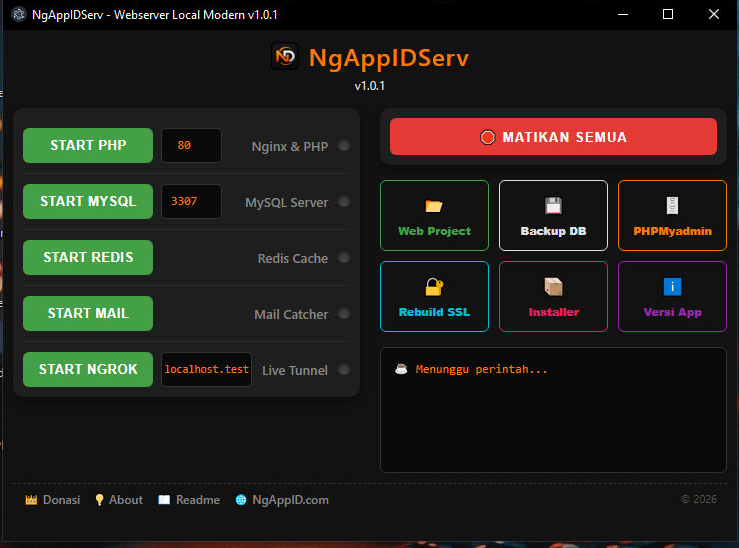

# ⚡ NgAppIDServ - WebServer Local Modern

**NgAppIDServ** adalah aplikasi *Web Server* Lokal modern berbasis GUI (Graphical User Interface) yang dirancang khusus untuk memudahkan workflow *developer* web. Dibuat menggunakan **Electron** dan **Node.js**, aplikasi ini menawarkan pengalaman manajemen server lokal sekelas *Enterprise* dengan fitur andalan **Auto-Virtual Host**, **Auto-SSL (HTTPS)**, **Pre-Flight Port Checker**, dan **Integrasi Ngrok** secara instan.

---

---

## 🚀 Fitur Utama

* 📂 **Auto Virtual Host:** Cukup buat folder baru di dalam direktori `www/` (misal: `www/tokoku`), aplikasi akan otomatis membuatkan domain lokal `tokoku.test` tanpa perlu konfigurasi file *hosts* manual.
* 🔐 **Auto SSL (HTTPS):** Setiap domain `.test` yang ter- *generate* akan langsung mendapatkan sertifikat SSL lokal yang valid menggunakan `mkcert`.
* 🛡️ **Pre-Flight Port Checker:** Bebas dari masalah silent fail! Sistem akan otomatis memindai ketersediaan Port sebelum Nginx/Database dinyalakan untuk mencegah bentrok dengan aplikasi lain (Skype, IIS, XAMPP).
* ⚙️ **Auto-Firewall Whitelist:** Mengonfigurasi Windows Defender Firewall secara otomatis di latar belakang tanpa memunculkan pop-up kuning yang mengganggu.
* 📦 **Auto Installer:** Unduh dan instal Framework (Laravel, CodeIgniter) atau CMS (WordPress, Joomla) ke dalam project hanya dengan sekali klik.
* 🌐 **Integrasi Ngrok 1-Klik:** Online-kan project lokalmu ke publik secara instan hanya dengan satu klik tombol "Start Ngrok".
* 📁 **Smart Project Manager:** Memindai seluruh daftar project di folder `www` yang dilengkapi dengan tombol pintas pembuka folder (File Explorer) dan pembuka web.
* 🔄 **Live Tech-Stack Detector:** Mendeteksi dan menampilkan versi Nginx, PHP, dan Database yang sedang aktif secara *real-time* langsung dari file *engine* eksekusi.
* 📌 **System Tray Minimize:** Berjalan diam-diam di *background* (*System Tray* Windows) agar *taskbar* tetap bersih dan responsif.

---

## 🔒 Fitur Dibatasi Khusus (PRO Version)

Fitur premium di bawah ini dikhususkan bagi pengguna yang sudah melakukan aktivasi lisensi (Donasi):

* 🔴 **Master Stop All** (Mematikan semua layanan secara bersih tanpa sisa proses di Task Manager)
* 🔐 **Rebuild SSL Otomatis**
* ⚡ **Redis Cache Server**
* ✉️ **Mail Catcher (Mailpit)**
* 🚀 **Live Tunnel (Ngrok)**
* 📦 **Auto Installer App Complete**

---

## 📦 Paket Terintegrasi (Tech Stack)

Aplikasi ini sudah di- *bundle* secara mandiri (*Portable-like*) dengan teknologi terbaru:

* **Nginx** v1.30.4
* **PHP** v8.3.32 (NTS Win32 x64)
* **MySQL / MariaDB** v8.4.10 / v11.4+ (Win x64)
* **phpMyAdmin** v5.2.3 (All Languages)
* **Redis Cache** v5.0.14.1 (x64)
* **Mailpit** (Mail Catcher amd64)
* **Ngrok** (Live Public Tunnel)
* **mkcert** (Auto SSL HTTPS)
* **Electron & Node.js** (Core UI Engine)

---

## 📂 Struktur Folder Penting

Setelah diinstal (default di `C:\ngappidserv`), perhatikan struktur folder berikut:

* `/www` : **Letakkan semua file project web / script PHP kamu di sini.**
* `/data/mysql` : Lokasi penyimpanan *raw data* dari database MySQL/MariaDB.
* `/bin` : Direktori *core engine* (Nginx, PHP, MySQL, Redis, dll). **Jangan diubah kecuali kamu tahu apa yang kamu lakukan.**

---

## 🛠️ Cara Penggunaan

1. **Jalankan sebagai Administrator (Wajib):**
   Klik kanan pada *shortcut* NgAppIDServ dan pilih **Run as Administrator**. Ini wajib agar aplikasi memiliki izin menulis konfigurasi domain `.test` ke dalam file *hosts* Windows & mengatur Firewall.
2. **Menambahkan Project Baru:**
   Buat folder baru di dalam folder `www`, misalnya folder `portofolio`. Domain `https://portofolio.test` otomatis bisa langsung diakses saat PHP & Nginx di- *start*.
3. **Akses Database:**
   Klik tombol **🗄️ Database / PHPMyAdmin** di dalam aplikasi.
   * **Port Database:** `3307` (Default, atau sesuai yang kamu tentukan di UI)
   * **Username:** `root`
   * **Password:** *(Kosongkan)*
4. **Testing Email Keluar:**
   Jika aplikasimu memiliki fitur kirim email, klik **Start Mail** dan buka `http://localhost:8025` di browser untuk melihat email yang masuk ke kotak masuk virtual (*Mail Catcher*).

---

## 👨‍💻 Untuk Developer (Build dari Source Code)

Jika kamu ingin mengembangkan atau memodifikasi aplikasi ini:

1. **Clone Repositori**
git clone [https://github.com/Yedincoder/NgAppIDServ.git](https://github.com/Yedincoder/NgAppIDServ.git)

2. **Masuk ke direktori**
cd NgAppIDServ

3. **Install Dependensi**
npm install

4. **Jalankan dalam Mode Development**
npm start

5. **Build File .EXE Installer**
npm run build

## ⚠️ Troubleshooting (Masalah Umum)

* **Layar Blank pada phpMyAdmin:** Pastikan ekstensi `mysqli`, `mbstring`, dan `session.save_path` sudah diaktifkan dan dikonfigurasi dengan benar di dalam file `php.ini`.
* **Server Nginx/MySQL Tidak Mau Start (Lampu Merah Terus):** Hal ini terjadi karena Port `80` atau `3307` sedang dipakai oleh aplikasi lain (seperti Skype, IIS, atau XAMPP lama). Solusinya: **Ganti angka port di kolom input aplikasi NgAppIDServ** sebelum mengeklik START.
* **Domain `.test` Tidak Ditemukan (Not Found):** Pastikan kamu membuka aplikasi NgAppIDServ dengan akses **Run as Administrator**. Jika tidak, sistem gagal mendaftarkan domain lokalmu ke `C:\Windows\System32\drivers\etc\hosts`.

## 👨‍💻 Author & Support

Dikembangkan dengan ☕ oleh **NgAppID Teams (@Yedincoder)**.

* **Email:** yedincoder@gmail.com
* **WhatsApp:** 081802161315
* **Website:** [ngappid.com](https://ngappid.com)

*Boleh Donasi Bro... buat Ngopi ☕*
